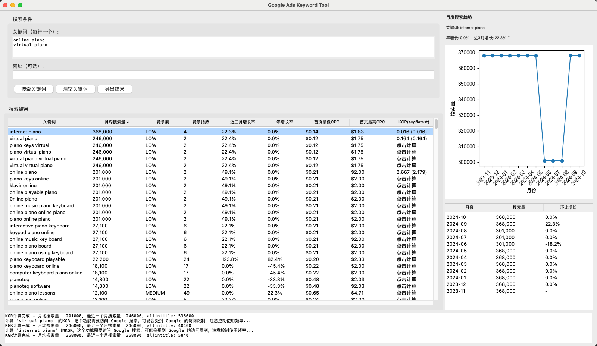

# Google Ads Keyword Tool

一个基于 Google Ads API 的关键词研究工具，可以获取关键词的搜索量、竞争度等数据，并计算 KGR (Keyword Golden Ratio) 值。

## 功能特点

- 支持批量查询关键词数据
- 支持通过网站 URL 发现相关关键词
- 提供关键词的月度搜索量、竞争度、CPC 等数据
- 自动计算 KGR 值（支持基于月均搜索量和最新月搜索量）
- 支持数据导出为 CSV 格式

## 前置准备
由于google ads api采用oauth2授权，需要先获取refresh token，因此事先做好下面两个准备：

### 1. Google Cloud Platform 配置

1. 访问 [Google Cloud Console](https://console.cloud.google.com/)
2. 创建新项目
3. 在 API 库中启用 Google Ads API
4. 创建凭据（Credentials）：
   - 选择 "OAuth client ID"
   - 应用类型选择 "Web Application" (**必须选择 Web 应用，这个类型在代码已经绑定死了的**)
   - 记录获得的 `client_id` 和 `client_secret`

### 2. Google Ads API 访问配置

1. 登录 Google Ads MCC 账户
2. 进入管理员 -> API 中心
3. 申请 API 访问权限：
   - 建议选择测试账号级别（足够开发测试使用）
   - 获取 `developer_token`
4. 创建测试账号：
   - 访问 [Google Ads API 测试账号](https://developers.google.com/google-ads/api/docs/best-practices/test-accounts?hl=zh-cn)
   - 点击"创建测试经理账号"
   - 获取账号 ID (格式: xxx-xxx-xxxx), 需手动移除分隔符，保留 10 位数字作为 `login_customer_id`

## 安装和配置

1. 克隆项目并安装依赖：
   ```bash
   git clone https://github.com/0xbyteray/google-ads-keyword-tool.git
   cd google-ads-keyword-tool
   pip install -r requirements.txt
   ```

2. 配置凭据：
   - 打开项目根目录下的 `config.yaml`
   - 填入在 `前置准备` 中获得的信息:
     ```yaml
     client_id: "YOUR_CLIENT_ID"
     client_secret: "YOUR_CLIENT_SECRET"
     developer_token: "YOUR_DEVELOPER_TOKEN"
     login_customer_id: "YOUR_LOGIN_CUSTOMER_ID"
     ```

3. 获取认证令牌：
   ```bash
   python generate_user_credentials.py
   ```
   - 这将打开浏览器进行 Google 账号认证
   - 认证成功后会在根目录生成 `.refresh_token` 文件
   - 注意：refresh token 有效期有限，过期需重新运行此脚本

## 使用说明

1. 启动程序：
   ```bash
   python main.py
   ```

2. 在界面中：
   - 输入关键词列表（每行一个）
   - 或输入网站 URL 获取相关关键词
   - 点击"搜索"开始获取数据

3. 关于 KGR 计算：
   - KGR = allintitle 结果数 / 月搜索量
   - 显示格式：KGR(avg/latest)，分别表示：
     - avg: 基于月均搜索量计算的 KGR
     - latest: 基于最新月搜索量计算的 KGR
   - 建议参考 latest 值，因为 allintitle 始终反映的是当前的搜索情况，使用最近月的搜索量才具有参考意义
   - 注意：由于使用 Google allintitle 指令，可能会受到访问限制，建议控制使用频率

## 注意事项

1. 保护好你的凭据信息（client_id, client_secret, developer_token 等）
2. 遵守 Google Ads API 的使用限制和政策
3. KGR 计算功能可能受 Google 搜索限制，建议适度使用
4. refresh_token 过期后需要重新运行认证脚本

## License

MIT License - 详见 [LICENSE](LICENSE) 文件